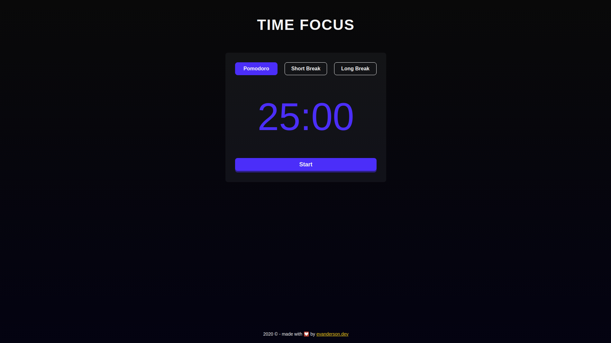

<h1 align="center">
TIMES FOCUS
 
 

  
 

</h1>

Um simples sistema de pomodoro

  

## Descrição

Esse projeto foi feito para me ajudar a administrar melhor meu tempo de estudo, mas existem tantos outros sites assim? Sim claro, mas serviu também para treino e espero que outras pessoas possam utilizar, ainda penso em adicionar novas funcionalidades.

- Veja o projeto online aqui: [Time Focus](https://evandersondev.github.io/timefocus/)

## Licença

Este projeto está licenciado sob a licença MIT - consulte a página [LICENÇA](https://opensource.org/licenses/MIT) para obter detalhes.
